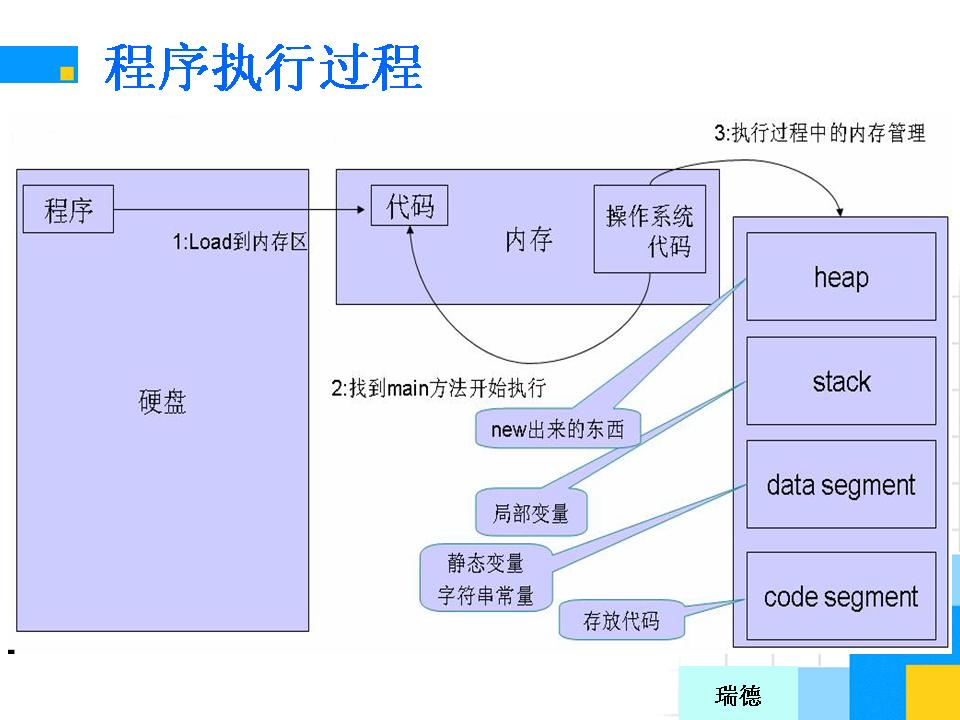
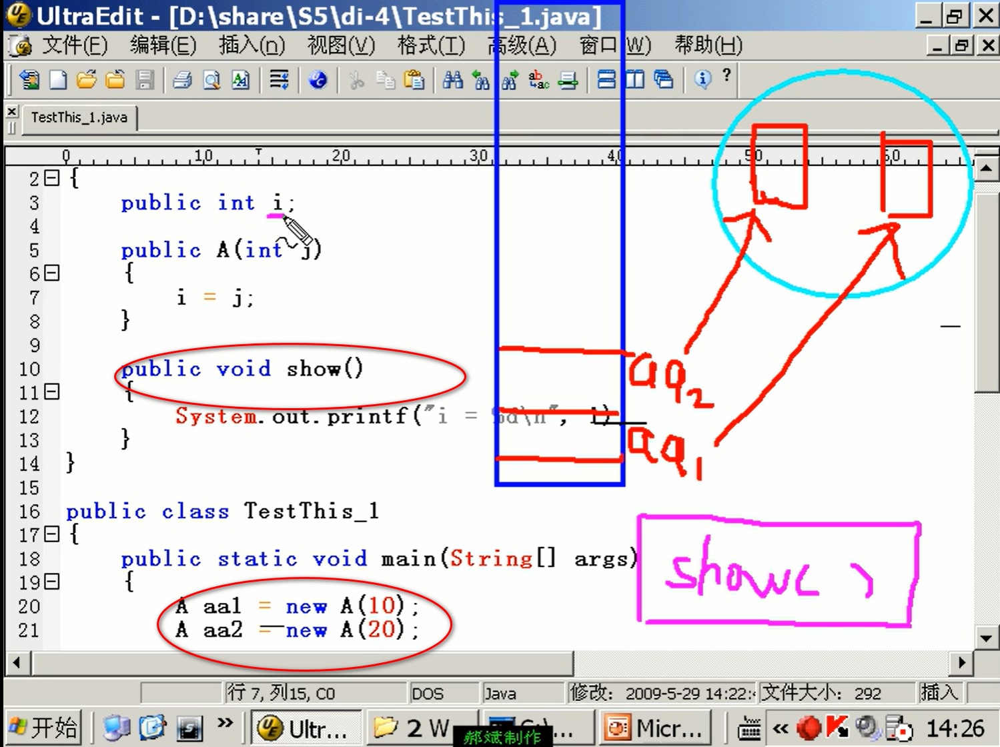
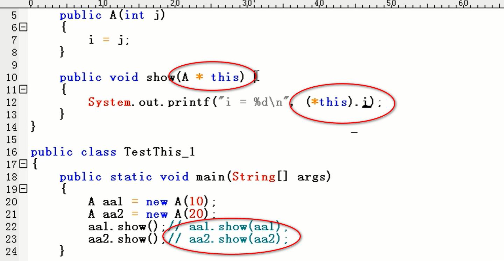
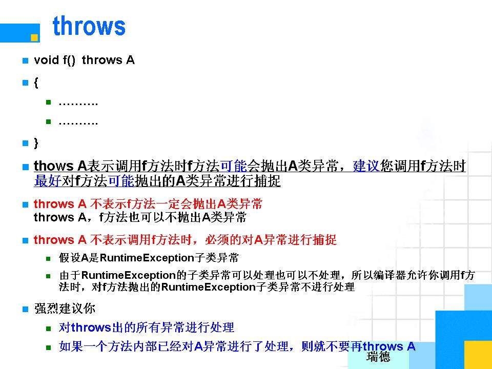

# 面向对象

## 类和对象

## 内存分配

```java
class A{
    int i;
    int j;
}
class TestMemo{
    public static void main(String[] args){
        A aa = new A(); //(A*)malloc(sizeof(A));
        	// new A();在堆中动态分配一块区域，被当作了A对象
        	// aa本身的内存是在栈中分配的
        	// 堆中内存的地址付给了aa
        	// aa指向堆中的内存，aa代表了堆中的内容
        	// aa.i 代表： aa这个静态指针变量所指向的动态内存中的A对象的i这个成员
        aa.i = 10;
        aa.j = 20;
        
    }
}
```



- 非java中，stack自动释放，heap需要手动释放。java中都自动了。
- 凡是在stack栈中的都只能在函数内使用，heap中的可以跨函数使用。

```java
class A{
    int i = 10;
    int j = 20;
}
class TestMemo{
    public static void main(String[] args){
        A aa1 = new A();
        A aa2 = aa1;
        
        aa1.j = 99;
        System.out.printf("%d\n", aa2.j); // 99
    }
}
```

## 访问控制符

- 将属性封装进类里，外面不能想面向过程语言那样随意修改（直接访问）里面的属性了。而是只向外界提供了一个按钮，像电视机一样，只有按按钮才能修改。这样变得安全。
- 私有方法（成员=属性+方法），外部不能访问

- protected和public都可以通过对象名.属性的方式访问

- 把一个类想成一个人，内部属性或方法都是自己的东西，访问控制符只是这个人控制自己想要对外部展示什么东西，隐藏什么东西。因此private的属性在内部也可以被内部其他东西访问，都是自己的。（在一个类的内部，所有的成员可以相互访问，访问控制符是透明的；访问控制符是针对外部访问而言的）

- ```java
  //static的存在则规定了另外的规则
  class Test{
      int age = 5;
      static void f() { //加static，mian函数能访问；不加static，main函数不能访问
          System.out.println("fffff");
      }
      
      public static void main(String[] args){
          f();
      }
  }
  ```

## 构造函数

- 构造函数不写void。写：public 类名() 

## 函数重载

- 函数名一样，传入参数不同（个数，类型，顺序），函数不同

## This

- this代表当前时刻正在创建的对象

## static

- 首先，static修饰后，仍然属于类，仍然可以通过创建新的对象来调用

- static修饰后，等于激活了它，它可以通过 [类名（首字母大写）].[属性或方法] 来调用

- static之后，该成员只有一个了，多个对象共用一个static的成员

- static只是表明了该成员具有了可以通过类名访问的潜在特征，但是否可以通过类名访问，还必须满足一个条件：该成员必须是非私有的。

- 若是被private了，就不能被类名.方法/属性 来调用了。（private在static前面，优先级应更高）

- 静态方法不能直接访问非静态成员（因为没有创建对象），非静态成员可以访问静态成员（因为创建了对象）

- 静态方法不能以任何方式引用this和super关键字（当静态方法被调用时，this所引用的对象根本就没有产生）

- ```java
  // 统计创建了几个对象
  class A{
      private int i;
      private static int cnt = 0;
      
      public A(){
          ++cnt;
      }
      
      public A(int i){
          this.i = i;
          ++cnt;
      }
      
      public static int getCnt(){
          return cnt;
      }
  }
  
  class TestStatic_1{
      public static void main(String[] args){
          System.out.printf("当前时刻A对象的个数是：%d\n",A.getCnt());
          A aa1 = new A();
          System.out.printf("当前时刻A对象的个数是：%d\n",A.getCnt());
          A aa2 = new A();
          System.out.printf("当前时刻A对象的个数是：%d\n",A.getCnt());
      }
  }
  ```

- ```java
  // 限制只能创造一个A
  class A{
      public int i = 20;
      private static A aa = new A(); // 先静态的创建了一个aa。它是一个属性。
      
      // 将构造方法通过private锁起来，这样只能通过上面那一行代码，在里面创建出一个对象
      private A(){     
      }
      
      public static A getA(){ // 这个方法公开给大家调用那个aa对象。static不能去掉
          return aa;			// 因为外部没法建对象了，只能通过类名.方法来调用它
      }
  }
  
  public class TestStatic_2{
      public static void main(String[] args){
          A aa1 = A.getA();
          A aa2 = A.getA();
          
          aa1.i = 99;
          System.out.printf("%d\n", aa2.i); // 输出99
          
          if (aa1==aa2){
              System.out.printf("相等"); // 输出相等
          }else{
              System.out.printf("不相等");
          }
      }
  }
  /*
  要理解六个知识点：
  1.构造函数被private了
  2.private static A aa = new A();理解如何new出对象
  3.private static A aa = new A();理解aa是一个属性
  4.private static A aa = new A();理解这里可以定义一个对象指向他本身
  5.public static A getA()；理解static不能省
  6.private static A aa = new A();理解static不能省
  */
  ```

- 静态main不能调用启动类里面的非静态函数

## 继承

- 私有的属性和方法不能被继承

- 私有的物理上已经被继承过来，只不过逻辑上程序员不能去访问它，因此继承必须慎重，否则会浪费内存

- 子类访问父类成员的三种方式

  - 在子类内部访问父类成员
  - 通过子类的对象名访问父类成员
  - 通过子类的类名访问父类成员
  - 代码演示

  ```java
  class A
  {
  	public static int i;
  	protected static int j;
  	private static int k;
  }
  
  class B extends A
  {
  	private void g()
  	{
  		i = 22;
  		//k = 20;
  	}
  }
  
  class M
  {
  	public static void main(String[] args)
  	{
  		A.i = 99;
  		//A.k = 99;  //error
  		B.i = 99; // 可。继承了过来。
  		//B.k = 99; //error
  		
  		B bb = new B();
  		bb.i = 99;
  		//bb.k = 99; //error
  	}
  }
  ```

- 子类永远无法继承父类的构造方法。因此，要在子类的构造方法中使用语句super(参数列表)调用父类的构造方法。（已经继承了父类的属性，需要初始化他们）（也可以全部用this.name = name，但父类属性很多时这样写会很繁琐）

- 继承时吧父类的方法继承了过来，即使从写了，它还在，即有两个同名同参同返回值的方法。（所以重写时不能把返回值改了）但父类的直接调用不了了，只有通过super.方法（）才能调用它

## super

- 子类永远无法继承父类的构造方法。因此，要在子类的构造方法中使用语句super(参数列表)调用父类的构造方法。（已经继承了父类的属性，需要初始化他们）（也可以全部用this.name = name，但父类属性很多时这样写会很繁琐；且父类属性私有时，访问不了，但用super构造方法可以）
- 普通方法中不能调用父类的构造方法（super（））
- 必须是构造方法的第一条语句
- 不写super，则默认调用super（）

## 重写

```java
class A{
    public void f(){
        System.out.printf("AAAA\n");
    }   
    public void f(int i){
        System.out.printf("哈哈\n");
    }
}

class B extends A{
    public void f(){ //重写f()
        super.f(); //调用从父类继承过来的f方法
        f(10);
        System.out.printf("BBBB\n");
    }
}
```

- 重写可以限制访问权限，不能放开访问权限（public -> protected可，protected -> public不可），因为多态
- 重写方法必须和被重写方法具有相同的方法名称，参数列表和返回值类型
- 子类中不允许出现于父类同名同参但不同返回类型的方法

## 多态

- 父类引用可以指向子类对象（父类在栈中声明了一块父类空间，同时子类在堆中划出了一块空间，生成了一个对象。然后把子类在堆里生成的对象的地址，发送给父类在栈中的位置存储）

- 反过来不行，因为动物可以指向一只狗，狗不能指向一只动物。

- ```java
  // 已知：C extends B,B extends A
  public class Test{
      public static void g(A aa){ // 实现了aa = aa;或 aa = bb;或 aa = cc;
          aa.f(); //(*aa).f();
      }
      
      public static void main(String[] args){
          A aa = new A();
          B bb = new B();
          C cc = new C();
          
          g(aa);
          g(bb);
          g(cc);
      }
  }
  ```

- 通过父类引用，只能访问子类从父类继承来的、重写的成员；不允许访问子类的特有成员。这样是为安全着想。
- 父类引用不能直接赋给子类引用。（语法不支持）
  - 只有再父类引用本身指向的就是一个子类对象时，才可以吧父类引用强制转化为子类引用
  - 其他情况下不允许把父类引用强制转化为子类引用

## 抽象类

- 抽象类的抽象方法，其子类必须实现该方法、
- 抽象类创建不出对象、
- 可以定义一个抽象类的引用( A aa; )，但不可以定义一个抽象类的对象
- 可以实现多态
- 抽象类里允许有普通方法

## final

- final可以修饰
  1. 整个类（不能再被继承）
  2. 属性（变成常量了：1.必须赋值，只能赋一次。2.不能再变。）
  3. 方法（不能被重写）
- 可以先定义空常量，然后在构造方法里面赋值，其他地方赋不了值。如果定义时赋了值，则不能再在构造函数里赋值。只能赋值一次。（默认值不算赋值）

## 接口

- 接口不允许对方法进行实现（不能加｛｝）
- [public] interface interfaceName [extends SuperInterfaceLIst] { 常量定义和方法定义}

1. 接口中定义的属性必须是public static fianal的，而接口中定义的方法则必须是public abstract的。这些修饰符可以部分或全部省略。

   ```java
   interface It{
       public static final int i = 20;
       public abstract void f();
   }
   // 省略版的写法
   interface It2{
       int i = 20;
       void f();
   }
   class A implements It2{
       public void f(){
           System.out.printf("i = %d\n",i);
       }
   }
   ```

2. 接口中定义的属性的值在实现类中不能被修改（因为是public static final的）

3. 一个类只能实现某个接口（implements），不能继承某个接口

4. 一个类可以实现多个接口（类似多继承），但一个类不能继承多个类

5. 接口可以继承接口，而且也可以继承多个接口。（接口允许多继承）

6. 如果一个类只实现了一个接口的部分方法，则该类必须的声明为抽象类。（因为会剩下一些抽象方法没有被重写，那样不行）

7. 一个类可以继承的一个父类同时实现多个接口。先继承，后实现。extends 在 implements 前。

8. 不可以new接口对象，但可以定义一个接口引用类型的变量，并将其指向实现接口的对象，从而达到多态的目的。

9. 接入接口后，重写时记得给上public。不然会是默认的default，这样会加强访问权限（由public变成default），这是不允许的。

   ```java
   interface It{
       void f();
   }
   class A implements It{
       public void f(){ // 记得给上public
           //...
       }
       public void g(){
           //...
       }
   }
   class D{
       public static void main(String[] args){
           It it;
           it = new A();
           it.f(); //接口引用指向类的对象，可以实现多态
           
           it.g() // error: 接口多态不能访问类的特有方法
       }
   }
   ```

10. 接口的多态，不能访问类的特有方法

- **接口的作用**
  - 通过接口可以实现不相关类的相同行为
    - 如Java规定所有可以完成自我赋值功能的类都必须实现iava.lang.Colneable接口，但该接口却是空的，该接口中没有任何内容，目的只是为了起个标志作用
  - 接口提供了不同对象进行协作的平台
    - 如事件处理
  - 接口可以实现多继承，从一定程度上弥补了类只能单继承的缺陷
  - 接口是我们了解一个类功能的重要途径
    - 如：java整个容器框架就是以接口的方式建立起来的，实现不同接口的类完成的是不同的功能，接口是我们了解一个类功能的重要途径
- **接口与抽象类的区别**
  - 接口中的方法不允许有方法体，但抽象类却允许
  - Java类不允许多继承，接口却允许多继承

## 其他

- 当一个对象呗创建时，会对其中各种类型的成员变量自动进行初始化赋值。但其他地方的局部变量编译时是不会自动进行初始化的，java要求所有的局部变量在使用之前都必须得初始化。
- 引用：对指针的危险功能进行屏蔽后剩下的东西，本质还是指针。
- A aa1 = new A();A aa2 = new A(); 
  - aa1、aa2在栈（存放指针）。
  - 两个对象在堆
  - show()方法存放在方法区，只有一个（代码区）。但被两个对象共同使用。
  - 
  - 内部存在这样一个过程：
  - 

- class写完了只是一个模型，必须照这个模型造一个事物，才能有实际存在（意义）。

- ```java
  /* 本程序证明了：一个类的属性可以是一个对象
  就像一辆车里面有各种零件：发动机，底盘等
  */
  class A{
      public void f(){
          System.out.printf("haha\n");
      }
  }
  
  class C{
      public int i = 10;
      public A aa = new A(); //aa是对象，也是C的一个属性
      
      public void g(){
          aa.f();
      }
  }
  
  class M{
      public static void main(String[] args){
          C cc = new C();
          cc.g();
      }
  }
  ```

- 一个类里面有两个函数同名同参但不同返回值是不行的，因为系统不知道调用哪个

- 强制转换是只是产生临时值，不会改变原来的
- java要求局部变量在使用之前必须初始化。但类的属性可以自动赋值。其他地方的局部变量不可以。

## 总结

- 封装
  - 访问控制符
    - 只有private的不能再外部访问
    - 类内部访问控制符是透明的
  - 构造方法
    - 定义：
      - 名字和类名一样
      - 无返回值
    - 注意事项：
      - 一个类对象只能调用一个构造方法
      - 一个类至少有一个构造方法
      - 如果自己定义了构造方法，编译器将不再提供默认的构造方法
  - this
    - 一个对象只含有属性的空间，n个对象共用一份方法的拷贝
  - static
- 继承
  - java是允许单继承
  - 私有成员无法被继承
  - 重写：
    - 方法名和参数列表和返回值必须一样
    - 访问权限不能过低
- 多态


<br>

<br>

<br>

<br>

# 包

### package的使用

- package语句必须得是第一条语句
- package zhangsan.lisi 表示：把该文件中所有的类放入zhangsan.lisi这个包中，并且该文件中所有的类真正的名字将是包名和类名的组合
- 如：类TestPackage的名字将变成是zhangsan.lisi.TestPackage,而不再是TestPacka
- 编译时建议使用：javac -d . TestPakage.java  而不使用 javac TestPackage.java。因为后者要自己手动建立包目录
- 如果不在当前路径下运行程序，则必须保证class文件的最上层目录的父目录位于classpath下
- 先检测当前目录下是否有zhangsan/lisi这个包（包即文件夹），如果有，再检测该包下是否有zhangsan.lisi.TestPackage这个类，如果没有，编译器将再去classpath设置的路径中依次查找。如果都查找失败，则运行时出错
- 在同一个包中只有私有的不能被另一个类访问，也只有私有的不能被继承

### 不同包之间的相互访问

- 在不同包没有任何关系的两个类，只有public类和public成员才可以被另一个包中的类访问 

```java
package com.ruide;
//import zhangsan.lisi.*;
import zhangsan.lisi.A;

class B{
    public static void main(String[] args){
        //zhangsan.lisi.A aa = new zhangsan.lisi.A();
        A aa = new A();
        aa.f();
    }
}
```

- 非内部类，只能写public或不写访问修饰符
- package语句必须排第一，import语句在它之下
- protected的方法可以被另一个包中的类继承过来，但只能在该类内部用，不能在外面用。public都可以。

<br>

<br>

<br>

<br>

# 异常

- 48~55
- 处理机制：
  1. 当java程序运行时出现问题时，系统会自动检测到该错误，并立即生成一个与该错误对应的异常对象
  2. 然后把该异常对象提交给java虚拟机
  3. java虚拟机会自动寻找相应的处理代码来处理这个异常，如果没有找到，则由java虚拟机做一些简单的处理后，程序被强行终止
  4. 程序员可以自己编写代码来捕捉可能出现的异常，并编写代码来处理相应的异常
- 处理异常，程序仍能执行
- 出错时，若没处理，抛给上一层，直到mian，然后抛给jvm，jvm会结束程序。
- 异常是个对象

```java
try{
    
}catch(Exception e){
    e.printStackTrace();
}finnally{
    
}
```

- java认为放在try里面的语句很可能执行不成功。

- scanner接受输入时，无法使用ifelse处理。所以必须用trycatch异常。

- throw和throws（throws是一种声明，意味着里面可能出现某种异常，但不处理，会抛出给调用者处理，throw用来抛出）（但如果throws的异常是runtime异常，那可以不catch。如果不是，则需要trycatch）

- 无论是否抛出异常，都执行finally

- ```java
  class A{
      //声明里面有这个错误没处理可能会抛出
  	int diveide(int a ,int b) throws DivisorIsZeroException{
          if(0 == b){
              throw new DivisorIsZsroException("除数不能为0"); //抛出异常
          }
          int m = a/b;
          return m;
      }
          
  }
  ```

  



<br>

<br>

<br>

<br>

# toString

- 所有类继承自Object,object有toString()方法。所有对象都可以调用该方法。返回的是地址。重写toString（）可以用来输出其他东西。
- 调用方法：
  - print该对象
  - aa.toString()会return

<br>

<br>

<br>

<br>

# String和StringBuffer

- 56~61
- String.valuesOf() 返回某个数的字符串形式

- StringBuffer
  - String类对象一旦创建就不可更改
  - 如果经常对字符串内容进行修改，则使用StringBuffer
  - 如果经常对字符串内容进行修改而使用String的话，就会导致即耗空间又耗时间
  - StringBuffer对象的内容是可以改变的，因此String类中没有修改字符串的方法，但是StringBuffer类中却有大量修改字符串的方法

<br>

<br>

<br>

<br>

# 数组

# 线程

- 67以后
- 阻塞，就绪
- extends Thread, run(), .start()
- implements Runnable, run(), A aa = new A(); Thread th1 = new Thread(aa);
- run(){while(flag){...}};
- public void shutDown(){this.flag = false;}

- 线程优先级，线程休眠，线程的让步，线程的串行化
- 线程的同步
- synchronized
- this.wait() this.notify()

### 买票

```java
/*
	法一
*/

class A implements Runnable
{
	public int tickets = 100;
	String str = new String("哈哈");
		
	public void run()
	{
		while (true)
		{
			synchronized (str)
			{
				if (tickets > 0)
				{
					System.out.printf("%s线程正在卖出第%d张票\n",
						Thread.currentThread().getName(), tickets);
					--tickets;	
				}
				else
				{
					break;
				}
			}
		}
	}
}

public class TestTickets_2
{
	public static void main(String[] args)
	{
		A aa = new A();
		Thread t1 = new Thread(aa);
		t1.start();	
		
		Thread t2 = new Thread(aa);
		t2.start();		
	}
}
```

```java
/*
	法二
*/

class A extends Thread
{
	public static int tickets = 100;  //static不能省
	public static String str = new String("哈哈");  //static不能省
		
	public void run()
	{
		while (true)
		{
			synchronized (str)
			{
				if (tickets > 0)
				{
					System.out.printf("%s线程正在卖出第%d张票\n",
						Thread.currentThread().getName(), tickets);
					--tickets;	
				}
				else
				{
					break;
				}
			}
		}
	}
}

public class TestTickets_3
{
	public static void main(String[] args)
	{
		A aa1 = new A();
		aa1.start();	
			
		A aa2 = new A();
		aa2.start();		
	}
}
```

### 生产消费

```java
/*
	2009年6月24日15:24:35
	生产和消费
*/

class SynStack 
{
	private char[] data = new char[6];
	private int cnt = 0; //表示数组有效元素的个数
	
	public synchronized void push(char ch)
	{
		while (cnt == data.length)
		{
			try
			{
				this.wait();
			}
			catch (Exception e)
			{
			}
		}
		this.notify(); 
		
		data[cnt] = ch;
		++cnt;
		System.out.printf("生产线程正在生产第%d个产品，该产品是: %c\n", cnt, ch);
	}
	
	public synchronized char pop()
	{
		char ch;
		
		while (cnt == 0)
		{
			try
			{
				this.wait();
			}
			catch (Exception e)
			{
			}
		}
		this.notify();
		ch = data[cnt-1];
		
		System.out.printf("消费线程正在消费第%d个产品，该产品是: %c\n", cnt, ch);
		
		--cnt;
		return ch;		
	}	
}

class Producer implements Runnable
{
	private SynStack ss = null;
	
	public Producer(SynStack ss)
	{
		this.ss = ss;
	}
	
	public void run() // throws Exception
	{
		//push('a');  //error
		char ch;
		
		for (int i=0; i<20; ++i)
		{
//			try{
//			Thread.sleep(100);
//			}
//			catch (Exception e){			
//			}
				
			ch = (char)('a'+i);
			ss.push(ch);
		}
	}
}

class Consumer implements Runnable
{
	private SynStack ss = null;
	
	public Consumer(SynStack ss)
	{
		this.ss = ss;
	}
	
	public void run()
	{
		for (int i=0; i<20; ++i)
		{
			try{
			Thread.sleep(100);
			}
			catch (Exception e){			
			}
			
			//System.out.printf("%c\n", ss.pop());
			ss.pop();
		}
	}
}


public class TestPC
{
	public static void main(String[] args)
	{
		SynStack ss = new SynStack();
		Producer p = new Producer(ss);
		Consumer c = new Consumer(ss);
		Thread t1 = new Thread(p);
		t1.start();
				
		Thread t2 = new Thread(c);
		t2.start();
	}
}


```

# 匿名类

- ```java
  // new的WindowAdapter称为匿名类
  f.addWindowListener(
  	new WindowAdapter(){
          @Override
          public void windowClosing(WindowEvent e){
              System.exit(-1);
          }
      }
  );
  ```

- 匿名类是一种特殊的内部类。如果在一个方法内部定义了一个匿名类，则该匿名类可以访问
  - 外部类的所有成员
  - 包裹该匿名类的mian方法中的所有final类型的局部变量（非final的局部变量无法被匿名类访问）

- ### 创建匿名类三种方法：

  1. #### 实现接口：

     - 假设A是接口名

     - ```java
       new A(){
       	实现接口中方法的代码
       }；
       ```

     - 功能：生成一个实现了A接口的匿名类

  2. #### 实现抽象类

     - 假设A是抽象类

     - ```java
       new A(){
       	实现了A类的所有抽象类的方法代码
           添加自己的方法或属性代码（不建议，因为没有实际意义）
       }；
       ```

     - 功能：生成一个匿名类，该匿名类必须得实现了A类中的所有抽象方法，当然该匿名类也可以定义自己的属性和方法

  3. #### 继承父类

     - 假设A是个类名

     - ```java
       new A(){
       	重写了A类的方法代码
           添加自己的方法或属性代码（不建议，因为没有实际意义）
       }；
       ```

     - 功能：生成一个A类的子类对象，该匿名类对象继承了A的所有非private成员

- 匿名类的优缺点
  - 如果一个类的语句比较少，逻辑比较简单，而且不经常变动，这个时候可以使用匿名类
  - 如果一个类包含了很重要的逻辑，将来要经常修改，则这个类就不应该当做匿名类来使用，匿名类会导致代码的混乱
