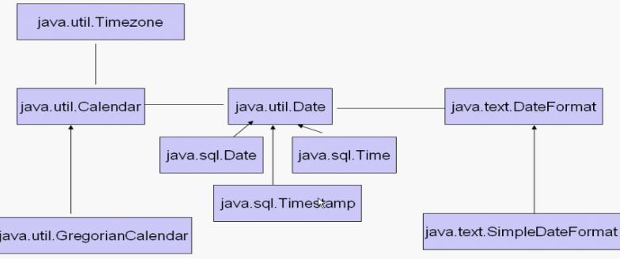

# 常用类

- 基本数据类型的包装类
- 字符串相关类
  - 不可变字符序列：String
  - 可变字符序列：StringBuffer、StringBuilder

- 时间处理相关类
  - Date
  - DateFormat、SimpleDateFormat
  - Calender

- Math类 

- File类 

- 枚举类：Jdk1.5

<br>

<br>

## 包装类


### 包装类和基本类型

#### 包装类与基本数据类型

包装类是将基本数据类型封装成一个类，包含属性和方法

#### 使用

在使用过程中，会涉及到自动装箱和自动拆箱

*   装箱：将基本数据类型转换成包装类
*   拆箱：将包装类转换成基本数据类型

#### 包装类与基本数据类型的转换

- 基本数据类型转换为包装类

- 包装类转换成基本类型

- **基本类型和包装类的自动转换**

  ```java
  Integer intObject = 5;
  int intValue = intObject;
  ```

| 转换            | 方法                                      |
| --------------- | ----------------------------------------- |
| int to Interger | Integer i = Integer.valueOf(传入一个int); |
| Interger to int | int i = someInterger.intValue();          |
|                 | Float f1 = new Float(3.14);               |
|                 | Double d1 = new Double(3.14);             |

```java
public class IntegerDemo {
    public static void main(String[] args) {
        int a = 10;
        Integer i = new Integer(10);
        //通过方法进行类型的转换
        Integer i2 = Integer.valueOf(a); // 基本数据类型转换为包装类
        int i3 = i.intValue(); // 包装类转换成基本类型
        System.out.println(a == i);
    }
}
```

#### 自动装箱和自动拆箱 (auto-boxing & unboxing)

- 自动装箱

  - 基本类型就自动地封装到与它相同类型的包装中，如：

    Integer i = 100;

  - 本质上是，编译器编译时为我们添加了：

    Integer i = Integer.valueOf(100);

- 自动拆箱

  - 包装类对象自动转换成基本类型数据。如：

    int a = new Integer(100);

  - 本质上，编译器编译时为我们添加了：

    int a = new Integer(100).intValue();

#### 注意

- interger与int 用"=="比较时，会自动把包装类型拆箱成基本类型。

```java
Interger i = 10;
int a = i;
System.out.println(a==i); // true
```

- 一些代码案例

```java
public class IntegerDemo {
    public static void main(String[] args) {
        
        int a = 10;
        Integer i = new Integer(10);
        //通过方法进行类型的转换
        Integer i2 = Integer.valueOf(a);
        int i3 = i.intValue();
        System.out.println(a == i); //true
        Float f1 = new Float(3.14);
        Double d1 = new Double(3.14);
        
        int i =100;
        Integer i1 = 100;
        Integer i2 = 100;
        Integer i3 = 200;
        Integer i4 = 200;
        System.out.println(i1==i2); //true
        System.out.println(i3==i4); //false

        Double d1 = 1.0;
        Double d2 = 1.0;
        Double d3 = 2.0;
        Double d4 = 2.0;
        System.out.println(d1==d2);//false
        System.out.println(d3==d4);//false

        Integer i = 10;
        int a = i;
        System.out.println(a==i);
    }
}
```

<br>

<br>

## 字符串（类）

注意：常量池在1.7之后放置在了堆空间之中

#### 字符串的使用

##### **1、创建**

- String str = "abc";
- String str2 = new String("abc");
- 两种方式都可以用，只不过第一种使用比较多

##### **2、字符串的本质**

- 字符串的本质是字符数组或者叫做字符序列
- String类是被final修饰的，不可以被继承
- 使用equals方法比较的是字符数组的每一个位置的值
- String是一个不可变对象

```java
String str1 = "abc";
String str2 = new String("abc");
// str2 = str2.intern();
System.out.println(str1==str2); // false
System.out.println(str1.equals(str2)); // true
```

#### String类方法

String类位于java.lang包中，具有丰富的方法：如计算字符串的长度、比较字符串、连接字符串、提取字符串

- **str.equals**(str2); 

  - //如果字符串与other相等，返回true

- **boolean equalsIgnoreCase(String other)** 

  - //如果字符串与other相等（忽略大小写），则返回true

- **str.charAt**(0)

  - //返回字符串中第index个字符。 

- **str.concat**("cde")

  - //本质是数组的复制过程

- **str.indexOf**("a")

  - //返回指定字符在字符串中第一次出现处的索引，如果此字符串中没有这样的字符，则返回 -1。

- **lastIndexOf**(String str,int idx)

  - // 

- String s = "abcdefghijklmn";

  System.out.println(**s.substring**(3));

  System.out.println(**s.substring**(3,5));

  - //在截取字符串的时候，需要注意是左闭右开区间[3,5)

- **s.length**()

  - //返回字符串的长度。

- String **replace**(char oldChar,char newChar) 

  - //返回一个新串，它是通过用 newChar 替换此字符串中出现的所有oldChar而生成的

- boolean **startsWith**(String prefix)

  - //如果字符串以prefix开始，则返回true

- boolean **endsWith**(String prefix) 

  - //如果字符串以prefix结尾，则返回true

- String **substring**(int beginIndex) 
  String **substring**(int beginIndex,int endIndex)

  - //返回一个新字符串，该串包含从原始字符串beginIndex到串尾或endIndex-1的所有字符

- String **toLowerCase**()

  - //返回一个新字符串，该串将原始字符串中的所有大写字母改成小写字母

- String **toUpperCase**()

  - //返回一个新字符串，该串将原始字符串中的所有小写字母改成大写字母

- String **trim**()

  - //返回一个新字符串，该串删除了原始字符串头部和尾部的空格

- str2 = str2.intern();

  

#### 代码案例

```java
String a = "abc";
String b = "def";
String c = "abcdef";
String d = a+b;
//String d = (a+b).intern();
String e = "abc"+"def";
System.out.println(c==d);//false
System.out.println(c==e);//true
////////////////////////////
String f = "a" + "b" +"c";
String a1 = "a";
String a2 = "b";
String a3 = "c";
String f1 = a1+a2+a3; 
//一共四个对象，f和f1是一样的
```

#### 可变字符串

可变字符串。是容器。

可变字符串
*   StringBuffer：线程安全，效率低
*   StringBuilder: 线程不安全，效率高

#### StringBuffer：

String增强版。字符串缓冲区，是一个容器

- StringBuffer声明

  ```java
  StringBuffer sb = new StringBuffer(); // 创建空StringBuffer
  StringBuffer sb = new StringBuffer("aaa"); // 创建一个变量存储字符串aaa
  ```

- StringBuffer的使用

  ```java
  sb.append("**"); //追加字符串
  ```

- 代码案例

  ```java
  public class StringBufferDemo {
      public static void main(String[] args) {
          StringBuffer stringBuffer = new StringBuffer(); // 创建空StringBuffer
          stringBuffer.append(1).append(1.234).append("abc").append(true); // 追加字符串
          System.out.println(stringBuffer); // 11.234abctrye
          System.out.println(stringBuffer.length()); // 13
          System.out.println(stringBuffer.capacity()); // 16
          
          StringBuilder stringBuilder = new StringBuilder();
          stringBuilder.append("123").append(1).append(false);
          System.out.println(stringBuilder);
      }
  }
  ```

#### StringBuilder:

和StringBuffer几乎一样。存在两个一样的原因是为了线程安全。StringBuilder是线程安全的（里面用synchronize加锁了）。

#### String使用陷阱：

- string s="a"; //创建了一个字符串
- s=s+"b"; //实际上原来的"a"字符串对象已经丢弃了，现在又产生了一个字符串s+"b"。如果多次执行这些改变串内容的操作，会导致大量副本字符串对象存留在内存中，降低效率。如果这样的操作放到循环中，会极大影响程序的性能。

<br>

<br>

## 时间类




```java
import java.text.DateFormat;
import java.text.ParseException;
import java.text.SimpleDateFormat;
import java.util.Calendar;
import java.util.Date;

public class DateDemo {
    public static void main(String[] args) throws ParseException {
        
        Date date = new Date();
        System.out.println(date);
        System.out.println(date.getTime()); // 输出毫秒值，非常有用（计算时）
        
        DateFormat dateFormat = new SimpleDateFormat("yyyy-MM-dd HH:mm:ss");
        //将Date类按照规范转换为字符串格式
        String str = dateFormat.format(date);
        System.out.println(str);
        
        //将字符串转换成对应的日期类
        Date d1 = dateFormat.parse("2010-10-10 20:20:20");
        System.out.println(d1);

        //获取的是当前系统的时间
        Calendar calendar = Calendar.getInstance();
        System.out.println(calendar);
        //设置指定时间的日历类
        calendar.setTime(d1);
        System.out.println(calendar);
        System.out.println(calendar.get(Calendar.YEAR));
        System.out.println(calendar.get(Calendar.MONTH));
        System.out.println(calendar.get(Calendar.DAY_OF_MONTH));
        System.out.println(calendar.get(Calendar.HOUR_OF_DAY));
        System.out.println(calendar.get(Calendar.MINUTE));
        System.out.println(calendar.get(Calendar.SECOND));
    }
}
```

<br>

<br>

## Math类

```java
System.out.println(Math.abs(-1)); 
System.out.println(Math.sqrt(2)); // 开方
System.out.println(Math.ceil(-3.14)); // 向上取整
System.out.println(Math.floor(-3.14)); // 向下取整
System.out.println(Math.pow(2,3)); // 2的三次方
```

<br>

<br>

## 枚举类 enum

枚举指由一组固定的常量组成的类型

1. 只能够取特定值中的一个
2. 使用enum关键字
3. 所有的枚举类型隐性地继承自 java.lang.Enum。（枚举实质上还是类！而每个被枚举的成员实质就是一个枚举类型的实例，他们默认都是public static final的。可以直接通过枚举类型名直接使用它们。）
4. 强烈建议当你需要定义一组常量时，使用枚举类型
5. 有了枚举类就不用重复创建多个相同的常量占空间，每次都是指向那一个就ok。

```java
public enum Gender {
    男,女
}
public class Test {
    Gender gender = Gender.女;
    Gender gender2 = Gender.男;
    }
}
```

```java
//  EventEnum.java
public enum EventEnum {

    LAUNCH("launch",0),PAGEVIEW("pageview",1),EVENT("event",2);
	
    private String name;  
    private int index;  
    
    EventEnum(String name,int index){
        this.name = name;
        this.index = index;
    }
	
    public String getName() {  
        return name;  
    }  
    
    public void show(){
        EventEnum[] ee = values();
        for(int i = 0;i<ee.length;i++){
            System.out.println(ee[i]);
        }
    }
}

// Test.java
public class Test {
    public static void main(String[] args) {
        EventEnum ee = EventEnum.LAUNCH;
        System.out.println(ee.getName());
        String name = EventEnum.PAGEVIEW.name(); 
        // .name()方法取的不是私有属性name，私有属性是取不到的；而是取的PAGEVIEW。
        System.out.println(name); // PAGEVIEW
        ee.show();
    }
}
/*
launch
PAGEVIEW
LAUNCH
PAGEVIEW
EVENT
*/
```

延伸：<br>

Java 枚举(enum) 详解7种常见的用法 https://blog.csdn.net/qq_39949109/article/details/80432477

<br>

<br>

<br>

<br>

# Java容器

<br>

<br>

## 集合框架

- 如果并不知道程序运行时会需要多少对象，或者需要更复杂方式存储对象——可以使用Java集合框架

- Java集合框架提供了一套性能优良、使用方便的接口和类，它们位于java.util包中

  

### Collection接口的常用方法

- 集合作为容器应该具有的功能（增，删，改，查）
- 不一定全有。
- 集合的基本操作：增加，删除，判断，取出

| 序号 | 方法名                                                       | 作用                    |
| ---- | ------------------------------------------------------------ | ----------------------- |
| 1    | add(Object obj)                                              | 添加,存储的是对象的引用 |
| 2    | size()                                                       | 容器中元素的实际个数    |
| 3    | remove(Object obj)<br>clear()<br>removeAll(Collection<?> c)<br>retainAll(Collection<? > c) | 删除                    |
| 4    | contains(Object obj)<br>isEmpty()                            | 判断元素                |
| 5    | iterator()                                                   | 遍历元素                |

```java
/*
* java集合框架：
*   Collection：存放的是单一值
*       特点：
*           1、可以存放不同类型的数据，而数组只能存放固定类型的数据
*           2、当使用arraylist子类实现的时候，初始化的长度是10，当长度不够的时候会自动进行扩容操作
*       api方法：
*           增加数据的方法
*           add：要求必须传入的参数是Object对象，因此当写入基本数据类型的时候，包含了自动拆箱和自动装箱的过程
*           addAll:添加另一个集合的元素到此集合中
*
*           删除数据的方法
*           clear:只是清空集合中的元素，但是此集合对象并没有被回收
*           remove:删除指定元素
*           removeAll：删除集合元素
*
*           查询数据的方法
*           contains:判断集合中是否包含指定的元素值
*           containsAll:判断此集合中是否包含另一个集合
*           isEmpty:判断集合是否等于空
*           retainAll:若集合中拥有另一个集合的所有元素，返回true，否则返回false
*           size:返回当前集合的大小
*
*           //集合转数组的操作
*           toArray:将集合转换成数组
* */
public class CollectionDemo {
    public static void main(String[] args) {
        Collection collection = new ArrayList();
        collection.add(1);
        collection.add(true);
        collection.add(1.23);
        collection.add("abc");
        System.out.println(collection);
        
        ((ArrayList) collection).add(0,"mashibing"); 
        // add(index,element)是ArrayList里面的方法，所以强制转换
        System.out.println(collection);
        
        Collection collection1 = new ArrayList();
        collection1.add("a");
        collection1.add("b");
        collection1.add("c");
        collection1.add("d");
        collection.addAll(collection1);
        System.out.println(collection);
        
//        collection.clear();
//        System.out.println(collection);
        
        System.out.println(collection.contains("a"));
        System.out.println(collection.containsAll(collection1));
        System.out.println(collection.isEmpty());
        
//        collection.remove("a");
//        System.out.println(collection);
        
        System.out.println(collection1.retainAll(collection));
        
        Object[] objects = collection.toArray();
        // 操作技巧：写完一个方法后不确定其返回类型，可以在后面写".var"，IDEA会自动补全。
        
        collection.add("a");//List不唯一，有序
        System.out.println(collection);

    }
}
```

### List与Set接口

- Collection 接口存储一组**不唯一**，**无序**的对象
- List 接口存储一组**不唯一，有序**（插入顺序）的对象
- Set 接口存储一组**唯一，无序**的对象
- Map接口存储一组键值对象，提供key到value的映射

#### List接口

List特点:有序，不唯一（可重复）<br>

- **ArrayList**实现了长度可变的数组，在内存中分配连续的空间。

  - 优点：遍历元素和随机访问元素的效率比较高

  - 缺点：添加和删除需要大量移动元素效率低，按照内容查询效率低

    

- **LinkedList**采用链表存储方式。

  - 优点：插入、删除元素时效率比较高

  - 缺点：遍历和随机访问元素效率低下

    

- **List**接口特有的方法

  凡是可以操作索引的方法都是该体系特有方法

  | 序号    | 方法名                                                       | 作用                                                         |
  | ------- | ------------------------------------------------------------ | ------------------------------------------------------------ |
  | 1（增） | add(index,element)<br>addAll(index,Collection)<br>addAll(Collection) | 在指定索引的位置上插入元素<br>在指定的引的位置上插入整个集合的元素<br>在结束插入整个集合的元素 |
  | 2（删） | remove(index)                                                | 根据索引删除指定的元素                                       |
  | 3（改） | set(index,element)                                           | 使用element替换指定索引位置上的元素                          |
  | 4（查） | get(index)<br>subList(from,to)<br>listIterator();            | 获取元素                                                     |

- 代码案例

```java
/*
* java集合框架：
*   List：存放的是单一值
*       特点：
*           1、可以存放不同类型的数据，而数组只能存放固定类型的数据
*           2、当使用arraylist子类实现的时候，初始化的长度是10，当长度不够的时候会自动进行扩容操作
*       api方法：
*           增加数据的方法
*           add：要求必须传入的参数是Object对象，因此当写入基本数据类型的时候，包含了自动拆箱和自动装箱的过程
*           addAll:添加另一个集合的元素到此集合中
*
*           删除数据的方法
*           clear:只是清空集合中的元素，但是此集合对象并没有被回收
*           remove:删除指定元素
*           removeAll：删除集合元素
*
*           查询数据的方法
*           contains:判断集合中是否包含指定的元素值
*           containsAll:判断此集合中是否包含另一个集合
*           isEmpty:判断集合是否等于空
*           retainAll:若集合中拥有另一个集合的所有元素，返回true，否则返回false
*           size:返回当前集合的大小
*
*           //集合转数组的操作
*           toArray:将集合转换成数组
* */

public class ListDemo {
    public static void main(String[] args) {
        List list = new ArrayList();
        list.add("a");
        list.add(1);
        list.add("a");
        list.add(true);
        System.out.println(list); 
        
//        System.out.println(list.get(3));
        System.out.println(list.indexOf("a"));
        System.out.println(list.lastIndexOf("a"));
        
        list.set(0,"mashibing");
        System.out.println(list);
        
        List list1 = list.subList(0, 2);
        System.out.println(list1);
        
//        List of = List.of(1,2,3,4);
//        System.out.println(of);  // [1,2,3,4]
    }
}
```

```java
/*
* linkedList拥有更加丰富的方法实，需要用的时候查询api即可，不需要记忆
*
* */
public class LinkedListDemo {
    public static void main(String[] args) {
        LinkedList linkedList = new LinkedList();
        linkedList.add(123);
        linkedList.add(false);
        linkedList.add("abc");
        System.out.println(linkedList);
        linkedList.add(2,"mashibing");
        System.out.println(linkedList);
        linkedList.addFirst("1111");
        System.out.println(linkedList);
        linkedList.addLast("2222");
        System.out.println(linkedList);
        System.out.println(linkedList.element());// 取第一个元素
        linkedList.offer("3333");// 等于add
        System.out.println(linkedList);
    }
}
```

```java
/**
 *      1、Vector也是List接口的一个子类实现
 *      2、Vector跟ArrayList一样，底层都是使用数组进行实现的
 *      3、面试经常问区别：
 *          （1）ArrayList是线程不安全的，效率高，Vector是线程安全的效率低
 *          （2）ArrayList在进行扩容的时候，是扩容1.5倍，Vector扩容的时候扩容原来的2倍
 *
 * */
public class VectorDemo {
    public static void main(String[] args) {
        Vector vector = new Vector();
        vector.add(1);
        vector.add("abc");
        System.out.println(vector);
    }
}
```


#### Set接口

