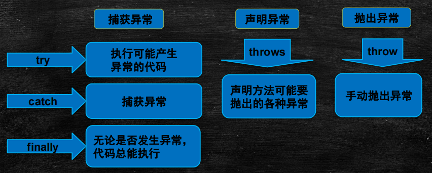
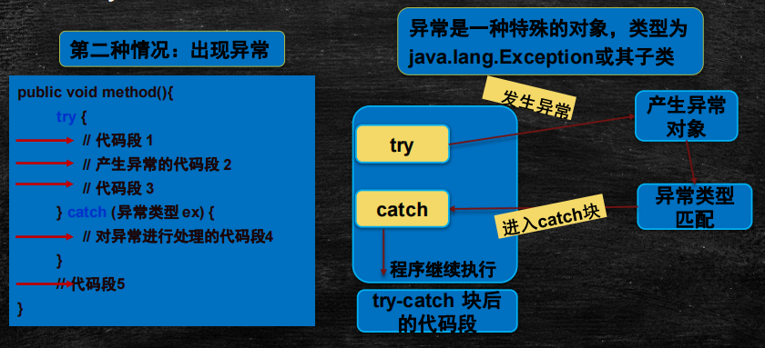
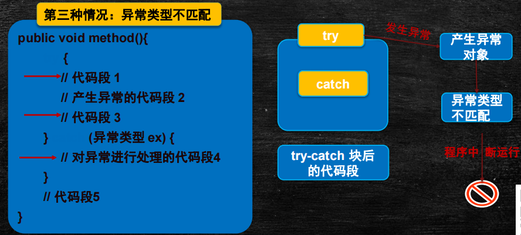
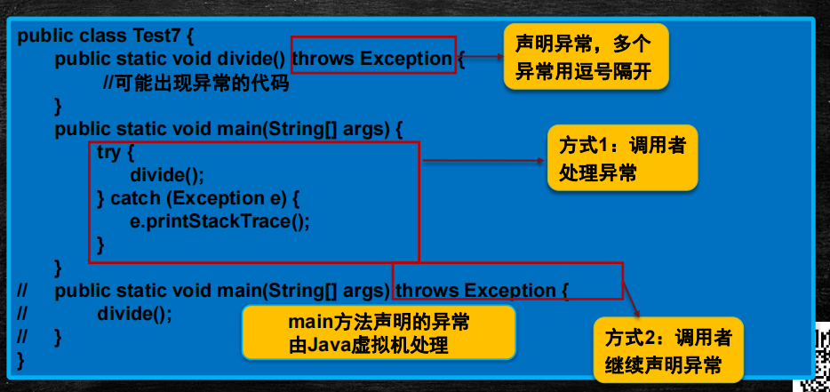

# 异常

<br>

<br>

## 异常 

在程序运行过程中，出现的不正常情况叫做异常

1. 相同的代码在运行的时候，根据输入的参数或者操作的不同，有可能会发生异常，有可能不会发生异常，应该在写代码的过程中尽可能的保证代码的正确性，不要到处都bug
2. 如果要解决代码中出现的异常，需要添加非常复杂的代码逻辑来进行判断，会使代码变得非常臃肿，不利于维护，可读性比较差。因此，推荐大家使用异常机制来处理程序运行过程中出现的问题
3. 程序在运行过程中如果出现了问题，会导致后面的代码无法正常执行，而使用异常处理机制之后，可以对异常情况进行处理。同时后续的代码会继续执行，不会中断整个程序
4. 在异常的处理过程中，不要只是简单的输出错误，要尽可能的讲详细的异常信息进行输出。使用 e.printStackTrace(); 打印异常的堆栈信息，可以从异常信息的最后一行开始追踪，寻找自己编写的java类

## 异常处理

Java编程语言使用异常处理机制为程序提供了错误处理的能力：

程序中预先设置好对付异常的处理办法 —> 程序运行 —> 异常 —> 对异常进行处理 —> 处理完毕，程序继续运行

**异常处理的方式**：

Java的异常处理是通过5个关键字来实现的：try、catch、finally、throw、throws



### 1、捕获异常 try...catch

try {代码逻辑} catch(Exception e) {异常处理逻辑}

```java
public class TestException {
    public static void main(String[] args) {
        Scanner in = new Scanner(System.in);
        try {
            System.out.print("请输入被除数:");
            int num1 = in.nextInt();
            System.out.print("请输入除数:");
            int num2 = in.nextInt();
            System.out.println(String.format("%d / %d = %d",
                    num1, num2, num1 / num2));
        }catch(Exception e){
            System.out.println("出现异常");
            e.printStackTrace();// 异常跟踪和输出
            //System.out.println("--------");
            //System.out.println(e.getMessage());
        }
        System.out.println("感谢使用本程序！");
    }
}
```

try {代码逻辑} catch(具体的异常 e) {异常处理逻辑} catch(具体的异常 e)：(推荐)

```java
public class TestException {
    public static void main(String[] args) {
        Scanner in = new Scanner(System.in);
        try {
            System.out.print("请输入被除数:");
            int num1 = in.nextInt();
            System.out.print("请输入除数:");
            int num2 = in.nextInt();
            System.out.println(String.format("%d / %d = %d",
                    num1, num2, num1 / num2));
        }catch(ArithmeticException e){
            System.out.println("数学异常，除数不能是0");
            e.printStackTrace();
        }catch (InputMismatchException e){
            System.out.println("输入的参数值类型不匹配");
            e.printStackTrace();
        }catch (NullPointerException e){
            System.out.println("空指针异常");
            e.printStackTrace();
        }
        System.out.println("感谢使用本程序！");
    }
}
```

 - #### 执行过程中可能存在的情况：

   1. **正常执行。**只执行try中的代码

   2. **遇到异常情况。**会处理try中异常代码之前的逻辑，后面的逻辑不会执行，最后会执行catch中的代码

      

      - （常用）catch(Exception e){} 里面写入：**e.printStackTrace()**;  输出异常的堆栈信息。堆栈跟踪功能显示出程序运行到当前类的执行流程
      - （少用）catch(Exception e){} 里面写入：System.out.println(**e.getMessage()**);。返回异常信息描述字符串，是printStackTrace()输出信息的一部分
      - （推荐）多写几个catch去捕获具体异常

   3. **异常类型不匹配。**使用多重catch的时候，会遇到异常子类不匹配的情况，此时依然会报错，因此建议在catch的最后将所有的异常的父类写上。可以针对每一种具体的异常做相应的更丰富的处理

      

- #### 注意：

  - 当使用多重的catch的时候一定要注意相关异常的顺序，将子类放在最前面的catch，父类放在后面的catch。（Exception是ArithmeticException的父类）

 - #### 常见的异常类型

   | 异 常 类 型                    | 说 明                                 |
   | ------------------------------ | ------------------------------------- |
   | Exception                      | 异常层次结构的父类                    |
   | InputMismatchException         | 输入类型不匹配                        |
   | ArithmeticException            | 算术错误情形，如以零作除数            |
   | ArrayIndexOutOfBoundsException | 数组下标越界                          |
   | NullPointerException           | 尝试访问 null 对象成员                |
   | ClassNotFoundException         | 不能加载所需的类                      |
   | IllegalArgumentException       | 方法接收到非法参数                    |
   | ClassCastException             | 对象强制类型转换出错                  |
   | NumberFormatException          | 数字格式转换异常，如把"abc"转换成数字 |

#### finally

在程序运行过程中，如果处理异常的部分包含finally的处理，那么无论代码是否发生异常，finally中的代码总会执行
*   finally包含哪些处理逻辑（过程）？
    1. IO流的关闭操作一般设置在finally中
    2. 数据库的连接关闭操作设置在finally中

```java
public class FinallyDemo {
    public static void main(String[] args) {
        try{
            System.out.println(1/10);
        }catch (Exception e){
            e.printStackTrace();
        }finally {
            System.out.println("我是finally处理块");
        }
    }
}
```

- return:
  - return自动留到最后执行，等整个异常处理执行完，才会执行return
  - finally中的return语句先于try中的return语句执行

```java
//1、情况一（try中有return，finally中没有return）：
	public class TryTest{
		public static void main(String[] args){
			System.out.println(test());
		}
	
		private static int test(){
			int num = 10;
			try{
				System.out.println("try");
				return num += 80;
			}catch(Exception e){
				System.out.println("error");
			}finally{
				if (num > 20){
					System.out.println("num>20 : " + num);
				}
				System.out.println("finally");
			}
			return num;
		}
	}
/*1、
输出结果如下：
try
num>20 : 90
finally
90
分析：显然“return num += 80”被拆分成了“num = num+80”和“return num”两个语句，线执行try中的“num = num+80”语句，将其保存起来，在try中的”return num“执行前，先将finally中的语句执行完，而后再将90返回。
*/

//2、情况二（try和finally中均有return）：
	public class TryTest{
		public static void main(String[] args){
			System.out.println(test());
		}
	
		private static int test(){
			int num = 10;
			try{
				System.out.println("try");
				return num += 80;
			}catch(Exception e){
				System.out.println("error");
			}finally{
				if (num > 20){
					System.out.println("num>20 : " + num);
				}
				System.out.println("finally");
				num = 100;
				return num;
			}
		}
	}
/*2、
输出结果如下：
try
num>20 : 90
finally
100
分析：try中的return语句同样被拆分了，finally中的return语句先于try中的return语句执行，因而try中的return被”覆盖“掉了，不再执行。
*/

//3、情况三（finally中改变返回值num）：
public class TryTest{
	public static void main(String[] args){
		System.out.println(test());
	}
 
	private static int test(){
		int num = 10;
		try{
			System.out.println("try");
			return num;
		}catch(Exception e){
			System.out.println("error");
		}finally{
			if (num > 20){
				System.out.println("num>20 : " + num);
			}
			System.out.println("finally");
			num = 100;
		}
		return num;
	}
}
/*3、
输出结果如下：
try
finally
10
分析：虽然在finally中改变了返回值num，但因为finally中没有return该num的值，因此在执行完finally中的语句后，test（）函数会得到try中返回的num的值，而try中的num的值依然是程序进入finally代码块前保留下来的值，因此得到的返回值为10。
*/

//4、情况四（将num的值包装在Num类中）：
public class TryTest{
	public static void main(String[] args){
		System.out.println(test().num);
	}
 
	private static Num test(){
		Num number = new Num();
		try{
			System.out.println("try");
			return number;
		}catch(Exception e){
			System.out.println("error");
		}finally{
			if (number.num > 20){
				System.out.println("number.num>20 : " + number.num);
			}
			System.out.println("finally");
			number.num = 100;
		}
		return number;
	}
}

class Num{
	public int num = 10;
}
/*
4、
输出结果如下：
try
finally
100
分析：虽然finally中改变了返回值num，但因为finally中没有return该num的值，因此在执行完finally中的语句后，test()函数会得到try中返回的num的值，而try中的num的值依然是程序进入finally代码块前保留下来的值。
从结果中可以看出，同样是在finally中改变了返回值num的值，在情况三中，并没有被try中的return返回（test（）方法得到的不是100），但在这里却被try中的return语句返回了。
*/
```

- 总结（面试点）：
  	 try语句在返回前，将其他所有的操作执行完，保留好要返回的值，而后转入执行finally中的语句，而后分为以下三种情况：

  - 情况一：如果finally中有return语句，则会将try中的return语句”覆盖“掉，直接执行finally中的return语句，得到返回值，这样便无法得到try之前保留好的返回值。

  - 情况二：如果finally中没有return语句，也没有改变要返回值，则执行完finally中的语句后，会接着执行try中的return语句，返回之前保留的值。

  - 情况三：如果finally中没有return语句，但是改变了要返回的值，这里有点类似与引用传递和值传递的区别，分以下两种情况，：

    - 1）如果return的数据是基本数据类型或文本字符串，则在finally中对该基本数据的改变不起作用，try中的return语句依然会返回进入finally块之前保留的值。

    - 2）如果return的数据是引用数据类型，而在finally中对该引用数据类型的属性值的改变起作用，try中的return语句返回的就是在finally中改变后的该属性的值。

### 2、声明异常 throws

throws:声明异常

在异常情况出现的时候，可以使用try...catch...finally的方式对异常进行处理，但除此之外，可以将异常向外抛出，由外部的进行处理

* 1、在方法调用过程中，可以存在N多个方法之间的相互调用，此时假如每个方法中都包含了异常情况，那么就需要在每个方法中都进行try。。catch，另外一种比较简单的方式，就是在方法的最外层调用处理一次即可。因此，使用throws的方法，对所有执行过程中的所有方法出现的异常进行统一集中处理。
* 2、如何判断是使用throws还是使用try...catch..
  * 最稳妥的方式是在每个方法中都进行异常的处理
  * 偷懒的方式是判断在整个调用的过程中，外层的调用方法是否有对异常的处理，如果有，直接使用throws,如果没有，那么就要使用try...catch...



```java
public class Excepton2 {
    public static void main(String[] args) throws Exception{ // throws Exception 扔到jvm
		test();
        // System.out.println("不会被打印出来"); // 不会被打印出来
    }
    public static void test() throws Exception{ // throws Exception 扔到main
        System.out.println(1/0); // 报错
    }
}
```

### 3、抛出异常 throw

throw配合throws使用。

如果：throw new Exception("性别出现错误"); 那么：e.printStackTrace();打印的就是 （"性别出现错误"）这一错误信息。

